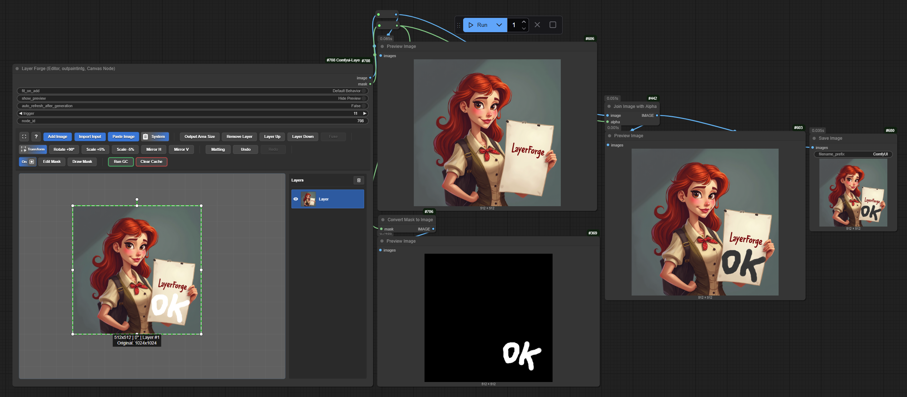
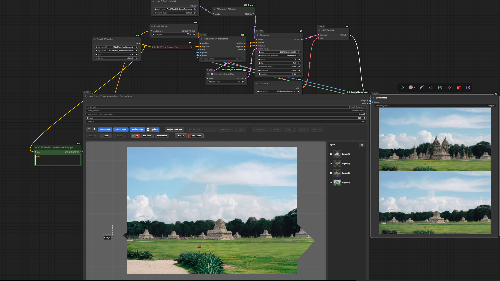

<h1 align="center">LayerForge – Advanced Canvas Editor for ComfyUI 🎨</h1>


<p align="center"><i>LayerForge is an advanced canvas node for ComfyUI, providing a Photoshop-like layer-based editing experience directly within your workflow. It extends the concept of a simple canvas with multi-layer support, masking, blend modes, precise transformations, and seamless integration with other nodes.</i></p>

<p align="center">

<a href="https://registry.comfy.org/publishers/azornes/nodes/layerforge" style="display:inline-flex; align-items:center; gap:6px;">
  
  
</a>
<a href='https://github.com/Azornes/Comfyui-LayerForge'>
  
</a>
  <a href="https://visitorbadge.io/status?path=https%3A%2F%2Fgithub.com%2FAzornes%2FComfyui-LayerForge">
    
  </a>
  
  
</p>

### Why LayerForge?

- **Full Creative Control:** Move beyond simple image inputs. Composite, mask, and blend multiple elements without
  leaving ComfyUI.
- **Intuitive UI:** Familiar controls like drag-and-drop, keyboard shortcuts, and a pannable/zoomable viewport make
  editing fast and easy.

---

https://github.com/user-attachments/assets/90fffb9a-dae2-4d19-aca2-5d47600f0a01

https://github.com/user-attachments/assets/9c7ce1de-873b-4a3b-8579-0fc67642af3a

## ✨ Key Features

- **Freeform Inpainting Area:** Draw any custom (like a polygonal lasso tool) area directly inside the image for inpainting. The tool generates content that is coherent with the rest of the image, without requiring a brush.
- **Persistent & Stateful:** Your work is automatically saved to the browser's IndexedDB, preserving your full canvas
  state (layers, positions, etc.) even after a page reload.
- **Multi-Layer Editing:** Add, arrange, and manage multiple image layers with z-ordering.
- **Advanced Masking Tool:** A dedicated masking mode with adjustable brush size, strength, and softness. Masks have
  their own separate undo/redo history.
- **Full Transformation Controls:** Precisely move, scale, and rotate layers with mouse or keyboard shortcuts.
- **Blend Modes & Opacity:** Apply 12 common blend modes (`Overlay`, `Multiply`, etc.) and adjust opacity on a per-layer
  basis via a context menu.
- **Comprehensive Undo/Redo:** Full history support for both layer manipulations and mask drawing.
- **Seamless I/O:**
    - **Drag & Drop** image files to create new layers.
    - **Copy & Paste** images directly from your system clipboard.
    - Import the last generated image from your workflow with one click.
- **AI-Powered Matting:** Optional background removal for any layer using the `BiRefNet` model.
- **Efficient Memory Management:** An automatic garbage collection system cleans up unused image data to keep the
  browser's storage footprint low.
- **Workflow Integration:** Outputs a final composite **image** and a combined alpha **mask**, ready for any other
  ComfyUI node.

---

## 🚀 Installation

### Install via ComfyUI-Manager
* Search `Comfyui-LayerForge` in ComfyUI-Manager and click `Install` button.

### Manual Install
1. Install [ComfyUi](https://github.com/comfyanonymous/ComfyUI).
2. Clone this repo into `custom_modules`:
    ```bash
    cd ComfyUI/custom_nodes/
    git clone https://github.com/Azornes/Comfyui-LayerForge.git
    ```
3. Start up ComfyUI.

---

## 🎯 Polygonal Lasso Inpainting Workflow

LayerForge's newest feature allows you to draw custom polygonal selection areas and run inpainting directly within ComfyUI. This brings Photoshop-like lasso tool functionality to your AI workflows.

### Setup Requirements

1. **Enable Auto-Refresh:** In LayerForge's settings, enable `auto_refresh_after_generation`. Without this setting, the new generation output won't update automatically in the canvas.

2. **Configure Auto-Apply (Optional):** If you want the mask to be automatically applied after drawing the shape, enable the `auto-apply shape mask` option in the Custom Output Area menu (appears on the left when a custom shape is active).

### How to Use Polygonal Selection

1. **Start Drawing:** Hold `Shift + S` and left-click to place the first point of your polygonal selection.

2. **Add Points:** Continue left-clicking to place additional points. Each click adds a new vertex to your polygon.

3. **Close Selection:** Click back on the first point (or close to it) to complete and close the polygonal selection.

4. **Run Inpainting:** Once your selection is complete, run your inpainting workflow as usual. The generated content will seamlessly integrate with the existing image.

### Advanced Shape Mask Options

When using custom shapes, LayerForge provides several options to fine-tune the mask quality:

- **Mask Expansion/Contraction:** Adjust the mask boundary by -300 to +300 pixels to ensure better blending
- **Edge Feathering:** Apply 0-300px feathering to create smooth transitions and reduce visible seams
- **Output Area Extension:** Extend the output area in all directions for more context during generation
- **Manual Blend Menu:** Right-click to access manual color adjustment tools for perfect edge blending

### Tips for Best Results

* Use **feathering (10–50px)** depending on the **size of the image** to create smooth transitions between the inpainted area and existing content. Larger images generally benefit from more feathering.
* Experiment with **mask expansion** (e.g., 10–20px) if you notice hard edges or visible seams.
* Use **Output Area Extension** based on image size:

  * **Extend the output area in all directions** to give the model more **context during generation**, especially for larger or more complex images.
* If **visible seams** still appear in the inpainting results:

  * Use the **Manual Blend Menu** (right-click on the mask area) to access **color and edge adjustment tools** for precise fine-tuning and seamless integration.
* **Image placement behavior:**

  * The generated or pasted image is automatically inserted into the area defined by the **blue shape** you draw.
  * The model uses the area within the **dashed white preview outline** as the **full context** during generation.
  * Make sure the dashed region covers enough surrounding content to preserve lighting, texture, and scene coherence.

---

## 🧪 Workflow Example

For a quick test of **LayerForge**, you can try the example workflow provided below. It demonstrates a basic compositing setup using the node.

**🔗 Download Example Workflow**

### 🔹 Simple Test Workflow
This workflow allows **quick testing** of node behavior and output structures **without requiring additional models or complex dependencies**. Useful for inspecting how basic outputs are generated and connected.


### 🔹 Flux Inpainting Workflow
This example shows a typical **inpainting setup using the Flux model**. It demonstrates how to integrate model-based fill with contextual generation for seamless content restoration.



**How to load the workflow:**
Click on the image above, then drag and drop it into your ComfyUI workflow window in your browser. The workflow should load automatically.

---

## 🎮 Controls & Shortcuts

### Canvas Control

| Action                       | Description                |
|------------------------------|----------------------------|
| `Click + Drag`               | Pan canvas view            |
| `Mouse Wheel`                | Zoom view in/out           |
| `Shift + Click (background)` | Start resizing canvas area |
| `Shift + Ctrl + Click`       | Start moving entire canvas |
| `Shift + S + Left Click`     | Draw custom polygonal shape for output area |
| `Single Click (background)`  | Deselect all layers        |
| `Esc`                        | Close fullscreen editor mode |
| `Double Click (background)`  | Deselect all layers        |

### Clipboard & I/O

| Action                   | Description                                     |
|--------------------------|-------------------------------------------------|
| `Ctrl + C`               | Copy selected layer(s)                          |
| `Ctrl + V`               | Paste from clipboard (image or internal layers) |
| `Drag & Drop Image File` | Add image as a new layer                        |

### Layer Interaction

| Action                | Description                     |
|-----------------------|---------------------------------|
| `Click + Drag`        | Move selected layer(s)          |
| `Ctrl + Click`        | Add/Remove layer from selection |
| `Alt + Drag`          | Clone selected layer(s)         |
| `Right Click`         | Show blend mode & opacity menu  |
| `Mouse Wheel`         | Scale layer (snaps to grid)     |
| `Ctrl + Mouse Wheel`  | Fine-scale layer                |
| `Shift + Mouse Wheel` | Rotate layer by 5°              |
| `Shift + Ctrl + Mouse Wheel` | Snap rotation to 5° increments |
| `Arrow Keys`          | Nudge layer by 1px              |
| `Shift + Arrow Keys`  | Nudge layer by 10px             |
| `[` or `]`            | Rotate by 1°                    |
| `Shift + [` or `]`    | Rotate by 10°                   |
| `Delete`              | Delete selected layer(s)        |

### Transform Handles (on selected layer)

| Action                 | Description                              |
|------------------------|------------------------------------------|
| `Drag Corner/Side`     | Resize layer                             |
| `Drag Rotation Handle` | Rotate layer                             |
| `Hold Shift`           | Keep aspect ratio / Snap rotation to 15° |
| `Hold Ctrl`            | Snap to grid                             |

### Mask Mode

| Action                       | Description                                                           |
|------------------------------|-----------------------------------------------------------------------|
| `Click + Drag`               | Paint on the mask                                                     |
| `Middle Mouse Button + Drag` | Pan canvas view                                                       |
| `Mouse Wheel`                | Zoom view in/out                                                      |
| **Brush Controls**           | Use sliders to control brush **Size**, **Strength**, and **Softness** |
| **Clear Mask**               | Remove the entire mask                                                |
| **Exit Mode**                | Click the "Draw Mask" button again                                    |

---

## 🤖 Model Compatibility

LayerForge is designed to work with **any ComfyUI-compatible model**. The node outputs standard image and mask data that can be used with any model or workflow. LayerForge automatically inserts the generated image into the exact shape and position you draw with the blue polygon tool — but only if the generated image is saved properly, for example via a Save Image node.

---

## 🧠 Optional: Matting Model (for image cutout)

The "Matting" feature allows you to automatically generate a cutout (alpha mask) for a selected layer. This is an
optional feature and requires a model.

> - **Model Name**: `BiRefNet`
> - **Download from**:
    >
- [Hugging Face](https://huggingface.co/ZhengPeng7/BiRefNet/tree/main) (Recommended)
- [Google Drive](https://drive.google.com/drive/folders/1BCLInCLH89fmTpYoP8Sgs_Eqww28f_wq?usp=sharing)
> - **Installation Path**: Place the model file in `ComfyUI/models/BiRefNet/`.

---

## 🔧 Troubleshooting

### `node_id` not auto-filled → black output

In some cases, **ComfyUI doesn't auto-fill the `node_id`** when adding a node.
As a result, the node may produce a **completely black image** or not work at all.

**Workaround:**

* Search node ID in ComfyUI settings.
* In NodesMap check "Enable node ID display"
* Manually enter the correct `node_id` (match the ID Node "LayerForge" shown above the node, on the right side).

> [!WARNING]  
> This is a known issue and not yet fixed.
> Please follow the steps above if your output is black or broken.

---

## 📜 License

This project is licensed under the MIT License. Feel free to use, modify, and distribute.

---

## 🙏 Acknowledgments

Based on the original [**Comfyui-Ycanvas**](https://github.com/yichengup/Comfyui-Ycanvas) by yichengup. This fork
significantly enhances the editing capabilities for practical compositing workflows inside ComfyUI.

Special thanks to the ComfyUI community for feedback, bug reports, and feature suggestions that help make LayerForge better.
